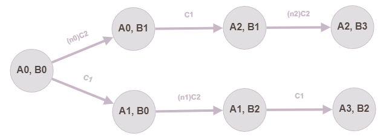

>Есть два регистра
R1 и R2
Есть две команды
C1: R1 := K*R2 - R1
C2: R2 := K*R1 + R2
Есть целевое число N
На входе: K, N, R1, R2
Нужно: распечатать минимальную последовательность из команд, позволяющую получить N в R1 или в R2 (в любом из двух регистров)
Либо напечатать ничего
Известно, что K != 0, R1 != R2, K, R1, R2 - натуральные, N - целое.

Задача взята из телеграм-канала Hashcoder (https://t.me/hash_coder)
https://t.me/hash_coder/193

#Решение:

Итак, условия задачи: есть пара регистров, два возможных действия и целевое значение.
Раз возможных действий два - значит дерево возможных значений регистров - двоичное (условно, идём влево - применяем С1, идём вправо - применяем С2). Базовое решение - прямо в лоб смоделировать это дерево и сравнивать значения в узлах дерева с целевым.

Теперь обратим внимание на действия:
1. Первое - `C1: R1 := K * R2 - R1`. Если его применить 2 раза, то получится `(2)C1: R1 := K * R2 - (K * R2 - R1) = R1`. То есть исполнение дважды команды C1 не имеет смысла, следовательно, после команды `C1` необходимо выполнить команду `C2`;
2. Второе - `С2: R2 := K * R1 + R2`. Если его применить N раз, то получится `(N)C2: R2 := N * K * R1 + R2`.

Исходя из прошлого абзаца, мы можем свести дерево к тому, что изображено далее

**_Здесь и далее значение R1 будет обозначаться как A, R2 - как В, а N - массив коэффициентов, обозначающих количество операций_**

Исходя из полученных условий, были получены следующие рекурсивные формулы расчёта А и В:

Раскрыв данные рекурсивные формулы получаем:

